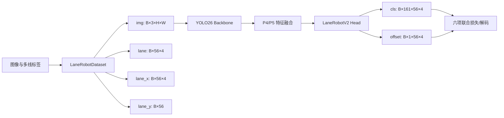

# Lane Robot 固定语义多线检测改造技术报告

> 文档版本：1.0  
> 报告日期：2026-07-28  
> 项目路径：`/home/xhm/Desktop/ULTRALYTICS_LANE_ROBOT`  
> 技术路线：Ultralytics YOLO26 + Row-Anchor Lane Detection

---

## 1. 摘要

本项目在原有 Lane Robot 单线检测代码基础上，将任务改造成**固定四语义槽位的多线检测系统**。改造后的模型能够在单张图像中同时预测 0～4 条具有确定语义的曲线，并保持训练、验证、可视化、预测结果保存等链路一致。

当前四个固定槽位为：

| `lane_id` | 名称 | 语义 |
|---:|---|---|
| 0 | `lane_follow` | 跟随线 |
| 1 | `lead_lane` | 引导线 |
| 2 | `channel_left` | 黄色通道左边界 |
| 3 | `channel_right` | 黄色通道右边界 |

当前系统的准确定位是：

> 固定四种语义、每种语义最多一条曲线的多线检测模型。

它不是任意数量的曲线实例检测模型，也不支持同一语义在一张图中出现多个实例。模型通过固定的 `lane_id` 将预测输出与具体业务语义直接绑定，因此不需要 Hungarian Matching 或动态实例匹配。

截至本报告形成时，以下主链路已经完成并经过基本验证：

```text
数据 YAML
→ 多线标签读取
→ 四槽位模型构建
→ 分类与偏移输出
→ 六项联合损失
→ 反向传播
→ Trainer
→ Validator
→ 权重保存
→ Predictor
→ 可视化与预测标签输出
```

---

## 2. 改造背景与目标

### 2.1 原始任务局限

原始 Lane Robot 任务主要面向单条目标线。其模型配置、标签张量和预测接口均围绕有限车道槽位设计，不能直接表达以下场景：

- 跟随线与引导线同时出现；
- 黄色通道左右边界同时出现；
- 不同语义曲线在同一图像中联合检测；
- 某些语义线存在、某些语义线缺失；
- 每条线仅在部分纵向采样位置可见。

### 2.2 改造目标

本次改造的核心目标包括：

1. 将模型输出槽位数扩展为 4；
2. 由数据 YAML 统一控制横向网格、纵向锚点和槽位数量；
3. 让数据集、模型头、损失函数和验证器使用完全一致的张量定义；
4. 保留 `x=-1` 表达局部不可见或不存在的能力；
5. 接通 Ultralytics 的训练和预测接口；
6. 使预测结果能够绘制并按训练标签格式保存；
7. 为后续 ONNX 导出和端侧部署保留稳定的固定形状输出。

### 2.3 非目标

当前阶段不包含：

- 任意数量曲线实例检测；
- 同一类别多实例检测；
- 实例分割；
- BEV 变换或 BEV 语义分割；
- 动态槽位分配；
- 基于 Hungarian Matching 的集合预测；
- 视觉重定位或全局地图裁剪；
- 完整的端侧量化精度验证。

---

## 3. 系统总体设计

### 3.1 固定槽位表示

模型将每一种业务语义映射到一个固定输出槽位：

```text
slot 0 → lane_follow
slot 1 → lead_lane
slot 2 → channel_left
slot 3 → channel_right
```

每个槽位包含 56 个纵向 Row Anchor。在每个 Row Anchor 上，模型预测：

- 横向网格类别；
- `no-lane` 类别；
- 亚网格偏移量。

因此，四条线不是在预测后通过几何关系排序得到，而是在训练阶段就由标签中的 `lane_id` 固定其语义。

### 3.2 数据流



### 3.3 输出张量定义

当前数据配置为：

```yaml
x_grids: 160
row_anchors: 56
num_lanes: 4
```

模型分类输出为：

```text
cls: [B, 161, 56, 4]
```

其中：

- `B`：批大小；
- `161`：160 个有效横向网格类别 + 1 个 `no-lane` 类别；
- `56`：纵向采样行数量；
- `4`：固定语义槽位数量。

亚网格偏移输出为：

```text
offset: [B, 1, 56, 4]
```

偏移经过 `tanh` 限制在 `[-0.5, 0.5]` 个网格单元内，用于改善离散网格带来的定位量化误差。

---

## 4. 数据协议

### 4.1 目录结构

推荐使用以下数据目录：

```text
datasets/
├── images/
│   ├── train/
│   └── valid/
├── labels/
│   ├── train/
│   └── valid/
└── labels_corrected/
    ├── train/
    └── valid/
```

图片与标签必须保持同名：

```text
datasets/images/train/abc.jpg
datasets/labels/train/abc.txt
```

### 4.2 标签格式

每一行表示一个固定语义槽位中的曲线：

```text
lane_id x1 y1 x2 y2 ... x56 y56
```

每行理论上包含：

```text
1 + 56 × 2 = 113 个数值
```

字段规则如下：

| 字段 | 规则 |
|---|---|
| `lane_id` | 当前模型只允许 `0、1、2、3` |
| `x` | 归一化横坐标，通常为 `[0,1]` |
| `x=-1` | 当前 Row Anchor 没有有效曲线点 |
| `y` | 归一化纵坐标，范围 `[0,1]` |
| 同一 `lane_id` | 单个标签文件中最多出现一次 |
| 整条线不存在 | 可以不写该 `lane_id` 对应行 |
| 局部不可见 | 保留该行，不可见位置写 `x=-1` |

例如仅存在黄色通道左右边界时：

```text
2 x1 y1 x2 y2 ... x56 y56
3 x1 y1 x2 y2 ... x56 y56
```

### 4.3 纵向锚点顺序

当前标签采用从图像底部向上排列的 56 个锚点：

```text
1.000000 → 0.333333
```

因此默认锚点生成逻辑必须为：

```python
np.linspace(y_end, y_start, row_anchors)
```

而不是从 `y_start` 到 `y_end`。该顺序已经在 `dataset.py` 中修正，并在预测端使用同样的顺序构造 `row_y`。

### 4.4 数据 YAML

当前配置文件为：

```text
ultralytics/cfg/datasets/lane-robot.yaml
```

核心内容：

```yaml
path: /home/xhm/Desktop/ULTRALYTICS_LANE_ROBOT/datasets

train: images/train
val: images/valid

x_grids: 160
row_anchors: 56
num_lanes: 4

y_start: 0.333333
y_end: 1.0

channels: 3
nc: 4

names:
  0: lane_follow
  1: lead_lane
  2: channel_left
  3: channel_right
```

---

## 5. 核心代码修改

### 5.1 数据配置成为结构参数的唯一来源

修改文件：

```text
ultralytics/models/yolo/lane/train.py
```

`LaneRobotTrainer.get_dataset()` 读取并规范化以下参数：

```text
x_grids
row_anchors
num_lanes
y_start
y_end
channels
names
```

关键行为包括：

- 校验 `x_grids >= 2`；
- 校验 `row_anchors >= 2`；
- 校验 `num_lanes >= 1`；
- 将 `nc` 设置为 `num_lanes`；
- 校验类别名称 ID 是否完整覆盖 `0..num_lanes-1`；
- 将解析后的结构参数同步到 `self.args.lane_*`；
- 未配置验证集时回退到训练集并输出警告。

`LaneRobotTrainer.get_model()` 随后将数据配置覆盖到模型配置：

```text
数据 YAML
   ↓
get_dataset()
   ↓
self.data / self.args
   ↓
get_model()
   ↓
覆盖 model_cfg 中的 x_grids、row_anchors、num_lanes、nc
   ↓
构建 LaneRobotModel
```

模型构建后立即读取 Lane Head，并检查：

```text
(head.x_grids, head.row_anchors, head.num_lanes)
```

是否与数据配置一致。该检查将原本可能在损失计算阶段才暴露的形状错误提前到模型初始化阶段。

### 5.2 默认配置同步

修改文件：

```text
ultralytics/cfg/default.yaml
```

当前关键默认值：

```yaml
lane_x_grids: 160
lane_row_anchors: 56
lane_num_lanes: 4
lane_y_start: 0.333333
lane_y_end: 1.0
```

该修改用于：

- 保持日志参数与实际任务一致；
- 防止缺少数据字段时回退到单线设置；
- 统一训练、验证和预测代码读取的默认纵向范围。

最终模型结构仍以数据 YAML 的解析结果为准。

### 5.3 多线 Dataset

修改文件：

```text
ultralytics/models/yolo/lane/dataset.py
```

数据集输出：

```text
img:     [3, H, W]
lane:    [56, 4]
lane_x:  [56, 4]
lane_y:  [56]
```

其中：

- `lane` 为整数横向类别；
- `lane_x` 为浮点横向网格位置；
- `lane_y` 保存纵向归一化坐标；
- 不可见点在 `lane` 中映射为 `no-lane` 类别 `x_grids`；
- 不可见点在 `lane_x` 中保留为 `-1`。

数据预处理采用直接 resize：

```python
im.resize((img_width, img_height), Image.BILINEAR)
```

当前实现未使用 LetterBox，因此图像坐标变换简单，训练和预测必须保持一致。

### 5.4 LaneRobotV2 多线检测头

修改或使用文件：

```text
ultralytics/nn/modules/head.py
```

`LaneRobotV2` 使用以下结构：

```text
输入融合特征
→ 1×1 Conv 降维
→ AdaptiveAvgPool2d(feat_h, feat_w)
→ Flatten
→ Fully Connected
→ ReLU
├── 分类分支 cls
└── 偏移分支 offset
```

分类分支输出：

```text
[B, x_grids + 1, row_anchors, num_lanes]
```

偏移分支输出：

```text
[B, 1, row_anchors, num_lanes]
```

模型导出模式下，两路结果沿类别维拼接，以生成固定张量输出：

```python
torch.cat((cls, offset), dim=1)
```

在当前配置下，导出张量理论形状为：

```text
[B, 162, 56, 4]
```

其中前 161 个通道为分类输出，最后 1 个通道为偏移输出。ONNX 推理代码必须按照该协议拆分，不能将全部 162 个通道都视为分类概率。

### 5.5 六项联合损失

修改或使用文件：

```text
ultralytics/utils/loss.py
```

当前 `LaneRobotLoss` 包含六个组成部分：

| 损失项 | 作用 |
|---|---|
| `lane_ce` | 横向网格分类损失，支持高斯软标签 |
| `lane_loc` | 基于局部 Soft-Argmax 的连续横向定位损失 |
| `lane_exist` | 有线/无线存在性二分类损失 |
| `lane_smooth` | 相邻 Row Anchor 一阶平滑约束 |
| `lane_curv` | 三个连续 Row Anchor 的二阶曲率约束 |
| `lane_offset` | 亚网格偏移回归损失 |

总损失形式为：

```text
L = λce·Lce
  + λloc·Lloc
  + λexist·Lexist
  + λsmooth·Lsmooth
  + λcurv·Lcurv
  + λoffset·Loffset
```

当前默认权重：

```yaml
lane_ce: 1.0
lane_loc: 2.0
lane_exist: 1.5
lane_smooth: 0.03
lane_curv: 0.02
lane_offset: 3.0
```

关键实现细节：

- 可见点可使用高斯软标签，而非仅使用单点 One-Hot；
- `no-lane` 类别索引固定为 `x_grids`；
- 连续坐标由局部 Top-K Soft-Argmax 解码；
- 偏移分支只在有效点上计算；
- 平滑和曲率项仅在相邻位置均有效时计算。

### 5.6 Predictor 与结果对象

修改文件：

```text
ultralytics/models/yolo/lane/predict.py
```

新增或完善：

```python
LaneResults
LaneRobotPredictor.pre_transform()
LaneRobotPredictor.postprocess()
```

预测链路为：

```text
模型原始输出
→ decode_lane()
→ [56, 4] 横向网格坐标
→ LaneResults
→ 日志摘要
→ 绘制曲线
→ 保存图片
→ 保存 txt
```

`LaneResults` 提供：

```text
result.lanes
result.row_y
result.active_lane_ids
result.verbose()
result.plot()
result.save()
result.save_txt()
```

预测标签保存格式与训练标签格式一致：

```text
lane_id x1 y1 x2 y2 ... x56 y56
```

### 5.7 训练与预测预处理对齐

检测任务默认 Predictor 常使用 LetterBox。当前 Lane Dataset 使用直接 resize，因此 Predictor 中重写了 `pre_transform()`，同样执行直接 resize。

此修改用于避免：

- Padding 改变纵向锚点与原图的对应关系；
- 训练时与预测时的纵横比例处理不一致；
- 解码后曲线映射回原图出现系统性偏移。

### 5.8 Validator

修改或使用文件：

```text
ultralytics/models/yolo/lane/val.py
```

当前整体指标包括：

| 指标 | 含义 |
|---|---|
| `lane_mae` | 有效点横向网格平均绝对误差 |
| `lane_mae_px` | 近似像素平均绝对误差 |
| `lane_acc_valid_tol1` | 误差不超过 1 个网格的有效点比例 |
| `lane_acc_valid_tol3` | 误差不超过 3 个网格的有效点比例 |
| `lane_acc_valid_tol5` | 误差不超过 5 个网格的有效点比例 |
| `lane_exist_acc` | 所有槽位、所有锚点上的存在性准确率 |

当前 Fitness 计算：

```text
fitness = Acc@3 + 0.5×Acc@5 - 0.003×MAE + 0.05×Exist
```

当前 Validator 计算的是所有槽位汇总指标，尚未按四个语义槽位分别统计。

---

## 6. 已完成验证

### 6.1 数据读取

真实样本读取结果已验证为：

```text
batch img shape:    (2, 3, 256, 320)
batch lane shape:   (2, 56, 4)
batch lane_x shape: (2, 56, 4)
batch lane_y shape: (2, 56)
```

说明多线标签能够被 Dataset 正确组织为固定四槽位张量。

### 6.2 前向传播

四线模型输出已验证为：

```text
cls shape:    (2, 161, 56, 4)
offset shape: (2, 1, 56, 4)
```

该结果与数据配置完全一致。

### 6.3 损失与反向传播

以下六项损失均可计算：

```text
lane_ce
lane_loc
lane_exist
lane_smooth
lane_curv
lane_offset
```

并且执行：

```python
loss.backward()
```

能够产生有限梯度，说明模型头、目标张量和联合损失的维度关系已经打通。

### 6.4 Trainer 与 Validator

已经完成至少 1 个 epoch 的真实训练流程验证，训练和验证均能正常结束，并输出：

```text
weights/last.pt
weights/best.pt
```

验证范围包括：

- GPU 前向传播；
- GPU 反向传播；
- 优化器更新；
- Trainer 生命周期；
- Validator 生命周期；
- 权重保存；
- 最终验证。

### 6.5 Predictor

已使用 `best.pt` 成功运行：

```text
yolo task=lane mode=predict
```

预测流程能够：

- 输出活动槽位名称；
- 保存绘制后的预测图片；
- 保存训练格式兼容的预测标签。

早期少量数据和单 epoch 模型仅证明工程链路可运行，不代表实际检测精度。

---

## 7. 使用方法

### 7.1 训练命令

建议先建立无几何增强基线：

```bash
yolo task=lane mode=train \
  model=ultralytics/cfg/models/26/yolo26n-lane.yaml \
  data=ultralytics/cfg/datasets/lane-robot.yaml \
  epochs=100 \
  batch=8 \
  imgsz=320 \
  workers=4 \
  device=0 \
  project=/home/xhm/Desktop/ULTRALYTICS_LANE_ROBOT/runs/lane \
  name=baseline_no_aug
```

显存不足时优先降低 `batch`，不要首先改变标签结构或锚点数量。

### 7.2 PyTorch 权重预测

```bash
yolo task=lane mode=predict \
  model=/path/to/best.pt \
  source=/home/xhm/Desktop/ULTRALYTICS_LANE_ROBOT/datasets/images/valid \
  imgsz=320 \
  device=0 \
  save=True \
  save_txt=True \
  project=/home/xhm/Desktop/ULTRALYTICS_LANE_ROBOT/runs/lane \
  name=predict_valid \
  exist_ok=True
```

### 7.3 推荐基线增强参数

由于黄色通道左右边界具有固定左右语义，建议初始训练关闭破坏拓扑关系的增强：

```yaml
degrees: 0.0
translate: 0.0
scale: 0.0
shear: 0.0
perspective: 0.0

fliplr: 0.0
flipud: 0.0

mosaic: 0.0
mixup: 0.0
cutmix: 0.0
copy_paste: 0.0

hsv_h: 0.0
hsv_s: 0.05
hsv_v: 0.10
```

水平翻转不能仅翻转图像。未来若启用，必须同步执行：

```text
x → 1 - x
channel_left ↔ channel_right
lane_id 2 ↔ lane_id 3
```

并单独确认 `lane_follow` 与 `lead_lane` 的语义是否在翻转后保持不变。

---

## 8. 标注修正工具与数据流一致性

当前辅助脚本建议放置于：

```text
/home/xhm/Desktop/ULTRALYTICS_LANE_ROBOT/scripts/
```

典型文件：

```text
scripts/manual_fix_56anchors_v8_relative_dataset.py
```

其默认数据流为：

```text
datasets/images/<split>
datasets/labels/<split>
          ↓ 编辑
datasets/labels_corrected/<split>
```

该工具具有：

- 固定 56 个纵向锚点；
- 手动控制点插值；
- 不可见位置保存为 `x=-1`；
- 原子写入；
- 断点恢复；
- 整线类别迁移；
- 优先加载已有修正标签。

### 8.1 风险一：标注工具允许类别 4

当前标注脚本的交互范围和颜色表允许类别 `0～4`，而当前模型配置仅允许 `0～3`。

如果标签中出现：

```text
lane_id = 4
```

当前 Dataset 会将其视为越界槽位并跳过。这可能导致标注内容未参与训练且不易被及时发现。

必须采取以下一种措施：

1. 将标注工具限制为 `0～3`；或
2. 明确新增第五种语义，并将 `num_lanes`、`nc`、`names` 和模型输出全部扩展为 5。

在当前四线任务下，推荐直接将标注工具限制为 `0～3`。

### 8.2 风险二：训练默认不读取 `labels_corrected`

当前训练 YAML 默认通过：

```text
images/... → labels/...
```

查找标签。标注工具修正后的结果位于：

```text
labels_corrected/...
```

因此修正完成后必须明确执行以下方案之一：

- 检查后将 `labels_corrected` 合并或替换到 `labels`；
- 在数据 YAML 中显式配置修正标签根目录；
- 修改 Dataset 标签路径映射规则，使训练直接读取 `labels_corrected`。

否则可能出现“修正结果已经保存，但训练仍读取旧标签”的问题。

---

## 9. 当前能力边界

### 9.1 已支持

- 每张图出现 0～4 条线；
- 四种固定业务语义；
- 每种语义最多一条曲线；
- 曲线局部缺失；
- 56 个固定 Row Anchor；
- 分类与亚网格偏移联合预测；
- 训练、验证、可视化和预测保存；
- 输出固定形状，便于部署。

### 9.2 未支持

- 两条 `channel_left` 同时出现；
- 任意数量未知语义曲线；
- 动态实例槽位；
- 实例间匹配；
- 逐槽位独立指标；
- 安全的语义感知水平翻转；
- 完整几何增强；
- ONNX 端到端数值一致性报告；
- INT8/低比特量化精度评估；
- 实车闭环控制稳定性验证。

---

## 10. 已知风险

| 风险 | 影响 | 优先级 | 建议措施 |
|---|---|---:|---|
| 四类数据分布不均衡 | 部分槽位完全学不会 | 高 | 统计每类图像数和有效点数 |
| 标注脚本允许 class 4 | 标签被 Dataset 静默跳过 | 高 | 将工具限制为 0～3 |
| 修正标签未接入训练目录 | 训练继续使用旧标签 | 高 | 固化 `labels_corrected → labels` 流程 |
| 缺少逐槽位指标 | 总体指标掩盖单类失败 | 高 | 在 Validator 中增加 per-lane metrics |
| 水平翻转未交换左右语义 | 产生错误监督 | 高 | 保持 `fliplr=0` 或实现槽位交换 |
| Predictor 与其他部署预处理不一致 | 坐标出现系统偏移 | 高 | ONNX 端严格使用直接 resize |
| 导出张量拼接 cls 与 offset | 推理拆分错误 | 高 | 按前 161/后 1 通道拆分 |
| 仅少量样本完成冒烟测试 | 无法代表真实精度 | 中 | 完整数据上训练正式基线 |
| 全连接式 Lane Head | 量化和输入分辨率适配需验证 | 中 | 进行 ONNX/端侧算子与精度测试 |

---

## 11. 后续实施计划

### 阶段一：数据闭环

1. 汇总完整数据集；
2. 校验图片和标签一一对应；
3. 检查每行是否包含 56 对坐标；
4. 检查 `lane_id` 是否只在 `0～3`；
5. 检查同一文件是否存在重复 `lane_id`；
6. 检查 `x` 是否为 `-1` 或合法坐标；
7. 检查全部标签的 `y` 锚点是否一致；
8. 将 `labels_corrected` 明确接入训练链路；
9. 统计四个槽位的样本数、有效点数和缺失率。

### 阶段二：正式训练基线

1. 关闭几何增强；
2. 使用统一输入尺寸训练；
3. 保存训练参数、代码提交和数据版本；
4. 对四种语义分别检查可视化结果；
5. 建立稳定的验证集和测试集。

### 阶段三：验证器增强

增加：

```text
lane_follow/MAE
lead_lane/MAE
channel_left/MAE
channel_right/MAE

lane_follow/Exist
lead_lane/Exist
channel_left/Exist
channel_right/Exist
```

还应增加每类：

- 有效点数量；
- 正样本图像数量；
- 完整曲线检测率；
- 最大横向误差；
- 近场和远场分段误差。

### 阶段四：安全数据增强

按照以下顺序逐项加入，并进行消融实验：

1. 轻微亮度变化；
2. 轻微饱和度变化；
3. 小范围平移；
4. 小范围缩放；
5. 极小角度旋转；
6. 带左右槽位交换的水平翻转。

每项几何增强必须同步更新：

```text
图像
x 坐标
y 坐标
有效性标记
固定槽位语义
```

超出图像范围的点必须改为 `x=-1`。

### 阶段五：ONNX 与端侧部署

1. 固化模型导出输出协议；
2. 验证 PyTorch 与 ONNX 输出形状；
3. 拆分分类张量和偏移张量；
4. 复现相同的直接 resize、RGB/BGR、归一化和维度顺序；
5. 对比 PyTorch 与 ONNX 的逐元素误差；
6. 对比最终曲线坐标误差；
7. 再进行 FP16、INT8 或目标 NPU 格式转换；
8. 分析量化前后各槽位的存在性和定位精度。

### 阶段六：控制接口

在模型精度稳定后，控制模块不应直接使用单个 Row Anchor，而应从预测曲线构造：

- 近场横向偏差；
- 曲线方向角；
- 曲率趋势；
- 通道中心线；
- 左右边界置信状态；
- 缺线或异常线的降级状态。

对于黄色通道，可由：

```text
channel_center = (channel_left + channel_right) / 2
```

在双方均有效的 Row Anchor 上生成通道中心参考线。仅检测到单侧边界时，需要结合通道宽度先验进行降级估计，不应直接将单侧边界当作车辆跟踪中心。

---

## 12. 工程管理建议

### 12.1 推荐仓库结构

```text
ULTRALYTICS_LANE_ROBOT/
├── ultralytics/
├── scripts/
├── datasets/
├── runs/
├── test/
├── test_infer/
├── docs/
│   └── lane_robot_multiline_technical_report.md
└── .gitignore
```

### 12.2 Git 管理

建议忽略大体积数据、运行输出和临时测试目录：

```gitignore
/datasets/
/runs/
/scripts/
/test/
/test_infer/
```

需要注意：若 `scripts/` 中包含需要长期维护的标注与检查工具，则不建议整体忽略 `scripts/`。更合理的做法是只忽略脚本生成的缓存、临时输出和本地路径配置，并将通用工具纳入版本控制。

### 12.3 提交粒度

建议将后续改动拆分为独立提交：

```text
Add per-lane validation metrics
Restrict label editor to four lane classes
Connect corrected labels to training dataset
Add safe lane-aware horizontal flip
Add ONNX export and runtime decoder
Add PyTorch-ONNX parity test
```

---

## 13. 结论

本次改造已经将 Lane Robot 从单线任务扩展为固定四语义槽位的多线检测任务，并完成了从数据读取到预测保存的完整工程闭环。

核心成果包括：

```text
四槽位标签协议
→ 数据 YAML 驱动模型结构
→ 四线 Dataset
→ LaneRobotV2 分类与偏移输出
→ 六项联合损失
→ Trainer/Validator
→ 多线 Predictor
→ 可视化和标签保存
```

当前最重要的工作不再是继续扩展基础模型结构，而是：

1. 完成全量数据质量检查；
2. 解决 `labels_corrected` 与训练标签目录的衔接；
3. 将标注工具类别范围限制为 `0～3`；
4. 建立无几何增强的正式基线；
5. 增加逐槽位指标；
6. 完成 ONNX 与端侧推理一致性验证。

在上述问题解决前，不应仅依赖整体训练损失或少量预测图片判断模型已经具备实际部署能力。

---

## 附录 A：关键文件索引

| 文件 | 作用 |
|---|---|
| `ultralytics/cfg/datasets/lane-robot.yaml` | 数据路径、锚点和槽位语义配置 |
| `ultralytics/cfg/default.yaml` | Lane 默认训练、损失和解码参数 |
| `ultralytics/cfg/models/26/yolo26n-lane.yaml` | YOLO26n Lane 模型结构 |
| `ultralytics/models/yolo/lane/dataset.py` | 多线标签读取与图像预处理 |
| `ultralytics/models/yolo/lane/train.py` | 数据配置解析、模型构建和训练器 |
| `ultralytics/models/yolo/lane/val.py` | Lane 验证器与整体指标 |
| `ultralytics/models/yolo/lane/predict.py` | 多线预测、结果封装、绘图和保存 |
| `ultralytics/models/yolo/lane/plotting.py` | 曲线解码与训练/验证可视化 |
| `ultralytics/nn/modules/head.py` | `LaneRobot` 与 `LaneRobotV2` 检测头 |
| `ultralytics/utils/loss.py` | `LaneRobotLoss` 六项联合损失 |
| `scripts/manual_fix_56anchors_v8_relative_dataset.py` | 56 锚点标签人工修正工具 |

## 附录 B：当前关键形状

```text
输入图像：          [B, 3, 256, 320]（已验证配置）
整数标签：          [B, 56, 4]
浮点横向标签：      [B, 56, 4]
纵向锚点：          [B, 56]
分类输出：          [B, 161, 56, 4]
偏移输出：          [B, 1, 56, 4]
导出拼接输出：      [B, 162, 56, 4]
解码后曲线：        [B, 56, 4]
```

## 附录 C：报告依据与验证边界

本报告基于当前项目修改总结、上传代码包中的 Lane 模块、数据配置、模型头、损失函数、验证器和标注修正脚本整理。

报告中的“已验证”指已有开发过程完成了对应工程冒烟测试或最小训练测试；除非另有完整实验记录，不代表已经在大规模正式测试集、真实机器人闭环或目标端侧硬件上达到可部署精度。
